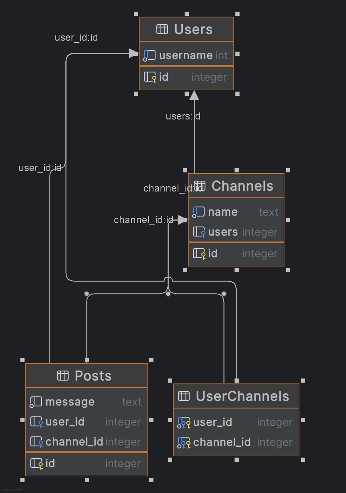

# Ide til layout af database
dette er en lille ide til hvordan du kunne strukturer din database

## Graph over database


## Create tables
her bruger jeg foreign keys til at referer til fields i andre tables.
læg mærke at UserChannels er en samlings table til det der hedder et "many-to-many relation"
```sql
CREATE TABLE Channels
(
    id integer primary key autoincrement,
    name text unique not null
);

CREATE TABLE Users (
    id integer primary key autoincrement,
    username int unique not null
);

CREATE TABLE Posts (
    id integer primary key autoincrement,
    message text not null
);

CREATE TABLE UserChannels (
    user_id integer not null,
    channel_id integer not null,
    PRIMARY KEY (user_id, channel_id),
    FOREIGN KEY (user_id) REFERENCES Users(id),
    FOREIGN KEY (channel_id) REFERENCES Channels(id)
);

ALTER TABLE Channels ADD COLUMN users integer REFERENCES Users(id);
ALTER TABLE Posts ADD COLUMN user_id integer REFERENCES Users(id);
ALTER TABLE Posts ADD COLUMN channel_id integer REFERENCES Channels(id);
```

## Inserting data

```sql
-- create channel
INSERT INTO Channels (name) VALUES ('the best channel in the world');

-- creating users
INSERT INTO Users (username) VALUES ('melosh');
INSERT INTO Users (username) VALUES ('melosh2');

-- adding users to channels
INSERT INTO UserChannels (user_id, channel_id) VALUES (1, 1);
INSERT INTO UserChannels (user_id, channel_id) VALUES (1, 2);
INSERT INTO UserChannels (user_id, channel_id) VALUES (2, 1);

-- creating a new post
INSERT INTO Posts (message, user_id, channel_id) VALUES ('hello world', 1,1 );
```

## Query Data

```sql
-- get specific Post
SELECT U.username, p.message, c.name channel_name from Posts p
    left join Users U ON user_id = U.id
    left join Channels C ON p.channel_id = C.id
    where p.id = 1;

-- get all posts in channel
SELECT U.username, p.message, c.name channel_name from Posts p
    left join Users U ON user_id = U.id
    left join Channels C ON p.channel_id = C.id;

-- get all users in channel
SELECT * FROM Channels c left join UserChannels uc ON c.id = uc.channel_id;

-- get all channels user is in
SELECT * from Users u left join UserChannels uc On u.id = uc.user_id where u.id = 1;

-- get all user posts
SELEcT * FROM Posts p where user_id = 1;
```